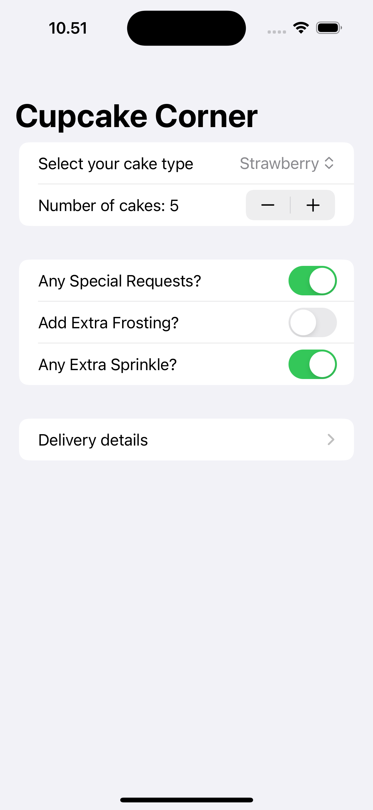
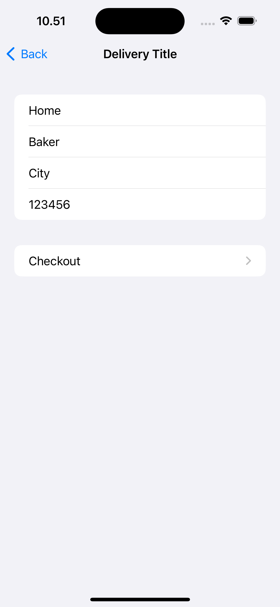
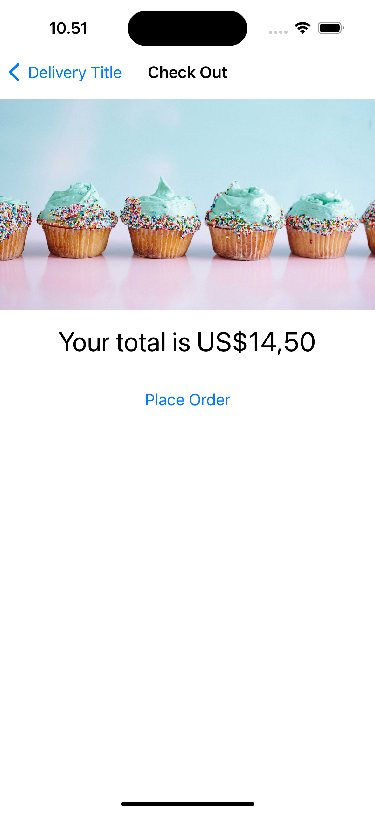

# CupcakeCorner
This is a basic learning project to create a multi-screen app for ordering cupcakes. The app allows users to input cupcake order details, set delivery information, and confirm their order through a checkout page.

---
The source learning is from 10th project of the course "100 Days of SwiftUI" (https://www.hackingwithswift.com/100/swiftui)

---
## Goals
1. Display a form to input cupcake order details, including type of cupcake, quantity, and any special requests.
2. Provide a second screen to input delivery details such as name, address, and contact information.
3. Show a final checkout confirmation page displaying the complete order summary.
4. Allow users to navigate seamlessly between screens and ensure a smooth ordering experience.
5. Validate form inputs to prevent incomplete orders from being placed.

# CupcakeCorner – Image Comments Feature

---
